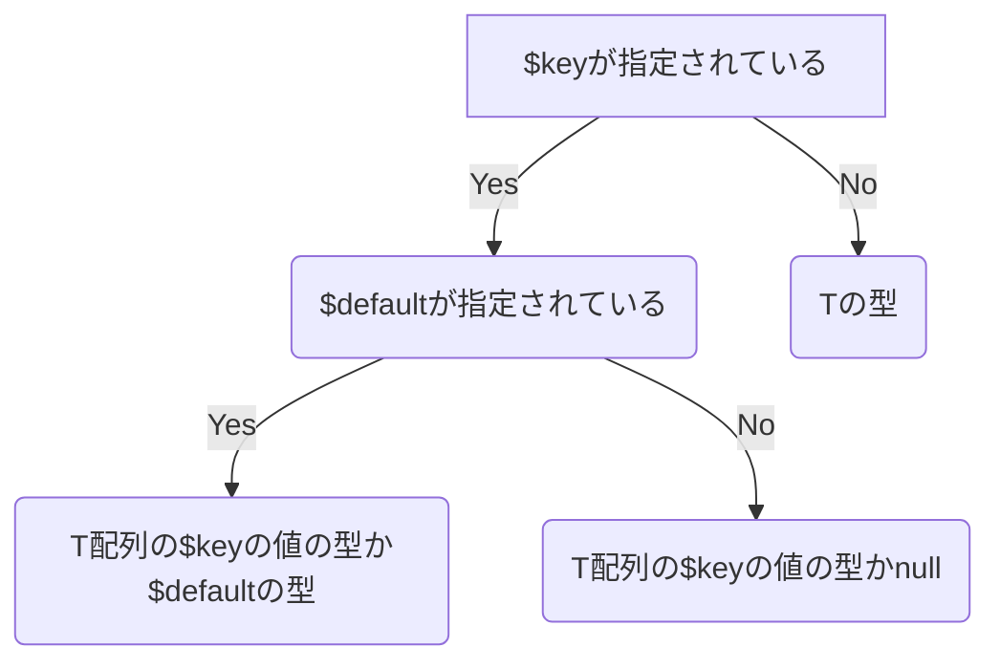

この記事は Laravel Advent Calendar 2023 18日目の記事です。
https://qiita.com/advent-calendar/2023/laravel

# Laravelを使っててつらみを感じる時
Laravelは柔軟性と機能の豊富さを持った素敵なフレームワークですが、Laravelが提供しているメソッドが便利すぎるが故に戻ってくる値の型がわからず、実際に処理やテストを実行するまでバグに気付けない時があります。

例えば`Illuminate\Foundation\Http\FormRequest`を継承した`BarRequest`クラスがあるとします
```php: BarRequest.php
class BarRequest extends FormRequest
{
    public function authorize(): bool
    {
        return true;
    }

    /**
     * @return array<string, \Illuminate\Contracts\Validation\ValidationRule|array|string>
     */
    public function rules(): array
    {
        return [
            'hoge' => ['integer'],
            'piyo' => ['string'],
            'fuga' => ['integer', 'in:5|6|7']
        ];
    }
}
```
このリクエストクラスからバリデーションした値を取り出すと以下のような問題が発生します
```php: BarController.php
class BarController extends Controller
{
    public function __invoke(BarRequest $request): void
    {
        // hugaというkeyは存在しないのにnullが帰ってくるのでタイポに気付けない
        $fuga = $request->validated('huga');

        // $piyoがnullになり得るのに、実行しないと気づくことができない
        $piyo = $request->validated('piyo');
        $this->useStringValue($piyo);

        // hogeとpiyoは型が違うが、実行しないと気づくことができない
        $hoge = $request->validated('hoge');
        $this->useStringValue($hoge);
    }

    private function useStringValue(string $piyo): void
    {
        //
    }
}
```
これらの問題は処理を実行するまで気づくことができず、テストに漏れがあった場合はバグに繋がります。
今回はこれらの問題をPHPStanを使って実行前の段階で気付けるようにしていこうと思います。

# 環境
- Laravel: 10.11.0
- larastan: 2.6.0(PHPStan1.6以上を使えれば今回はOKです)
- PHPStanのレベル: 8(後述しますが、レベル8にすることでnullのチェックができます)

# 実装
## 達成したい要件
今回は例にあげたバリデーションクラスを拡張して以下の要件を達成していきます
1. `rules()`配列のキーに存在する文字列のみ or nullのみ`validated()`の第一引数に渡されるようにする
2. `validated()`の引数によって変わる戻り値の型を明確にする

## 準備
今回は`validated()`メソッドのみ拡張したいので`Illuminate\Foundation\Http\FormRequest`を継承したクラスを作成し、その中に`validated`メソッドを作成します。
`validated()`内で処理の内容は変えないので親クラスの処理をそのまま呼び出します。
```php: BaseRequest.php
abstract class BaseRequest extends FormRequest
{    
    public function validated($key = null, $default = null)
    {
        return parent::validated($key, $default);
    }
}
```
このクラスを先ほどの`BarRequest`クラスで継承します
```diff php: BarRequest.php
- class BarRequest extends FormRequest
+ class BarRequest extends BaseRequest
```
これで拡張の事前準備ができました。ここからこれらのクラスに変更を加えていきます。
:::message
ここからは型を確認できる`\PHPStan\dumpType()`やエディタでPHPStanのエラーを確認できる拡張を使いながら進めると理解しやすいと思います。
:::

## 1. `rules()`配列のキーに存在する文字列のみ or nullのみ`validated()`の第一引数に渡されるようにする
これを実現するにはどういう配列が渡されているかをPHPStanに伝える必要があります。
そのためにPHPStanの[ジェネリクス](https://phpstan.org/writing-php-code/phpdoc-types#generics)を使います
```diff php: BaseRequest.php
+ /**
+  * @template T of array<string, mixed>
+  */
abstract class BaseRequest extends FormRequest
```
```diff php: BarRequest.php
+ /**
+  * @extends BaseRequest<array{
+  *     hoge?: int,
+  *     piyo?: string,
+  *     fuga?: 5|6|7
+  * }>
+  */
abstract class BaseRequest extends FormRequest
```
これで`BaseRequest`に`rules()`で使用される配列を伝えることができました。
次に`BaseRequest`の`validated()`の第一引数の`$key`にとりうる値を制限します
```diff php: BaseRequest.php
+ /**
+  * @param key-of<T>|null $key
+  */
public function validated($key = null, $default = null)
{
    return parent::validated($key, $default);
}
```
これで`$key`にはTに渡された配列のkeyの文字列であるhoge, piyo, fugaかデフォルトのnullのみに制限することができました。
試しにBarControllerクラスでkeyを間違えた時がどうなるか試してみましょう
```php: BarController.php
class BarController extends Controller
{
    public function __invoke(BarRequest $request): void
    {
        $request->validated();  // OK

        $request->validated('hoge');  // OK

        $request->validated('huga');  // Parameter #1 $key of method {{クラス名}}::validated() expects 'fuga'|'hoge'|'piyo'|null, 'huga' given.
    }
}
```
配列のキー以外の文字列が渡された時にPHPStanでエラーを出すことができましたね👏
これで1の「`rules()`配列のキーに存在する文字列のみ or nullのみ`validated()`の第一引数に渡されるようにする」を達成することができました

## 2. `validated()`の引数によって変わる戻り値の型を明確にする
次に`validated()`の引数によって変わる戻り値の型をPHPStanに伝えられるようにします。
これを達成するためには以下の条件によって型が変わるということをPHPStanに伝える必要があります

条件が複雑なので1ずつ対処していきましょう
### `$key`が指定されてない時はTの型
これはシンプルでreturnの型にTを指定してあげるだけです。
```diff php: BaseRequest.php
/**
 * @param key-of<T>|null $key
+ * @return T
 */
public function validated($key = null, $default = null)
```
これで$keyに指定がない時はTに渡された配列の型が戻るように指定することができました。

### `$key`が指定してあるときはT[$key]の型かnull
まず、T配列の$keyの値の型を取得するにはPHPStanの[Offset access](https://phpstan.org/writing-php-code/phpdoc-types#offset-access)を使います。
通常の配列のように配列の中から指定キーの値の型を取得できます。
```diff php: BaseRequest.php
/**
 * @param key-of<T>|null $key
- * @return T
+ * @return T[key-of<T>]|null
 */
public function validated($key = null, $default = null)
```
これで`$key`が指定されたときの戻り値の型を指定できましたが、`$key`が指定されていない時にTが戻ることを指定できなくなってしまいました。
これを解決するためにPHPStanの[Conditional return type](https://phpstan.org/writing-php-code/phpdoc-types#conditional-return-types)を使って型による条件分岐を行います。
さらに`key-of<T>`が何回も出るようになったので`K`というテンプレートに置き換えます
```diff php: BaseRequest.php
/**
- * @param key-of<T>|null $key
- * @return T[key-of<T>]
+ * @template K of key-of<T>
+ * @param K|null $key
+ * @return ($key is null ? T : T[K]|null)
 */
public function validated($key = null, $default = null)
```
これで`$key`が指定されていない時はT, `$key`が指定されている時はT[$key]の型を戻り値として指定することができました。
ここまでをまた、BarControllerで試してみましょう
```php: BarController.php
class BarController extends Controller
{
    public function __invoke(BarRequest $request): void
    {
        $all = $request->validated();
        $this->useStringValue($all['piyo'] ?? null); // OK

        $piyo = $request->validated('piyo');
        $this->useStringValue($piyo); // OK

        $hoge = $request->validated('hoge');
        $this->useStringValue($hoge); //Parameter #1 $piyo of method {{クラス名}}::useStringValue() expects string|null, int|null given.
    }

    private function useStringValue(?string $piyo): void
    {
        //
    }
}
```

### `$default`が指定されている時はT配列の`$key`の値の型か`$default`の型
次に`$default`が渡されている時のケースを考えます。
筆者は`$default`を指定するときはT[K]と型を揃えるようにしているので今回もその方針でいきます。
`$default`の型はT[K]かnullになるのでそれを指定してあげます。
```diff php: BaseRequest.php
/**
 * @template K of key-of<T>
 * @param K|null $key
+ * @param T[K]|null $default
 * @return ($key is null ? T : T[K]|null)
 */
public function validated($key = null, $default = null)
```
これで`$default`にはT[K]と違う値は指定できなくなりました
```php: BarController.php
class BarController extends Controller
{
    public function __invoke(BarRequest $request): void
    {
        $request->validated('hoge', 0);  // OK

        $request->validated('hoge', 'default hoge');  // Parameter #2 $default of method {{クラス名}}::validated() expects int|null, string given
    }
}
```
次に`$default`によって変わる戻り値の型を再度[Conditional return type](https://phpstan.org/writing-php-code/phpdoc-types#conditional-return-types)を使って条件分岐していきます
```diff php: BaseRequest.php
/**
 * @template K of key-of<T>
 * @param K|null $key
 * @param T[K]|null $default
- * @return ($key is null ? T : T[K]|null)
+ * @return ($key is null ? T : $default is null ? T[K]|null : T[K])
 */
public function validated($key = null, $default = null)
```

これで`$key`が指定されていない時は`T`,
`$key`が指定されている時は`T[K]|null`,
`$default`が指定されている時は`T[K]`を戻り値として指定できるようになりました。

# 完成系
完成した`BaseRequest.php`が以下になります
```php
/**
 * @template T of array<string, mixed>
 */
abstract class BaseRequest extends FormRequest
{
    /**
     * @template K of key-of<T>
     * @param K|null $key
     * @param T[K]|null $default
     * @return ($key is null ? T : $default is null ? T[K]|null : T[K])
     */
    public function validated($key = null, $default = null)
    {
        return parent::validated($key, $default);
    }
}
```
最後にこれを一番最初にあげたBarControllerで確認してみましょう
```php: BarController.php
class BarController extends Controller
{
    public function __invoke(BarRequest $request): void
    {
        // keyをタイポしている
        $fuga = $request->validated('huga');  // Parameter #1 $key of method {{クラス名}}::validated() expects 'fuga'|'hoge'|'piyo'|null, 'huga' given.

        // 戻り値がnullになりうる
        $piyo = $request->validated('piyo');
        $this->useStringValue($piyo); // Parameter #1 $piyo of method {{クラス名}}::useStringValue() expects string, string|null given.

        // hogeとpiyoは型が違う
        $hoge = $request->validated('hoge');
        $this->useStringValue($hoge);  // Parameter #1 $piyo of method App\Http\Controllers\Generics\BarController::useStringValue() expects string, int|null given.
        
        $piyo2 = $request->validated('piyo', 'default');
        $this->useStringValue($piyo2);  // OK
    }

    private function useStringValue(string $piyo): void
    {
        //
    }
}
```
これで見事戻り値の厳密な型チェックを行い、最後のパターンのみエラーが出ないようにすることができました👏
:::message
2番目のnullをなりうる値のチェックはPHPStanのレベルが8でないと無視されてしまいます
:::

# まとめ
近年goやTypeScriptなど静的型付け言語が流行しています。
動的型付け言語であるPHPも言語レベルでのサポートはまだまだなものの、PHPStanを使えばgoやTypeScriptには敵わずとも、最低限のことはできるようになっていると思います。
今後のプログラミングはいかに静的解析と一緒に戦えるかだと思っているので引き続き機能を増やして欲しいですね
